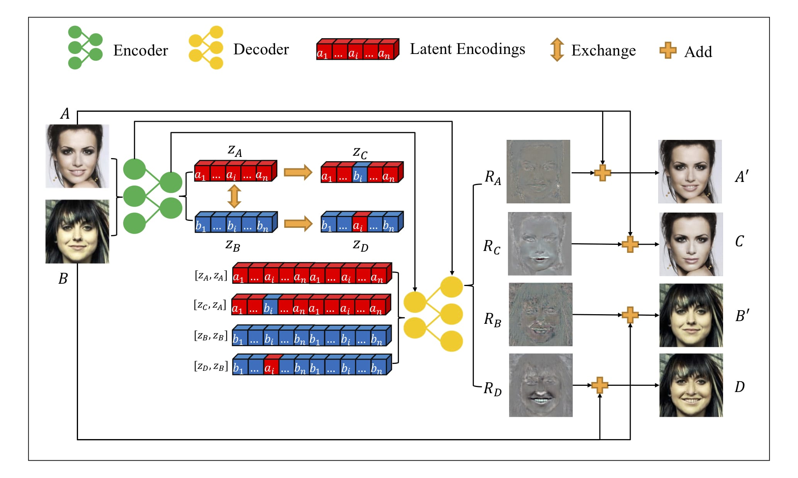
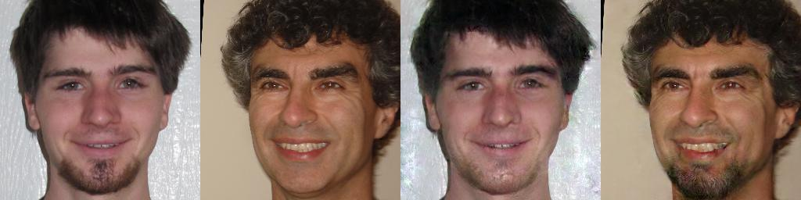
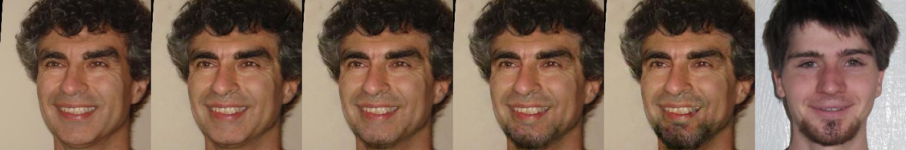
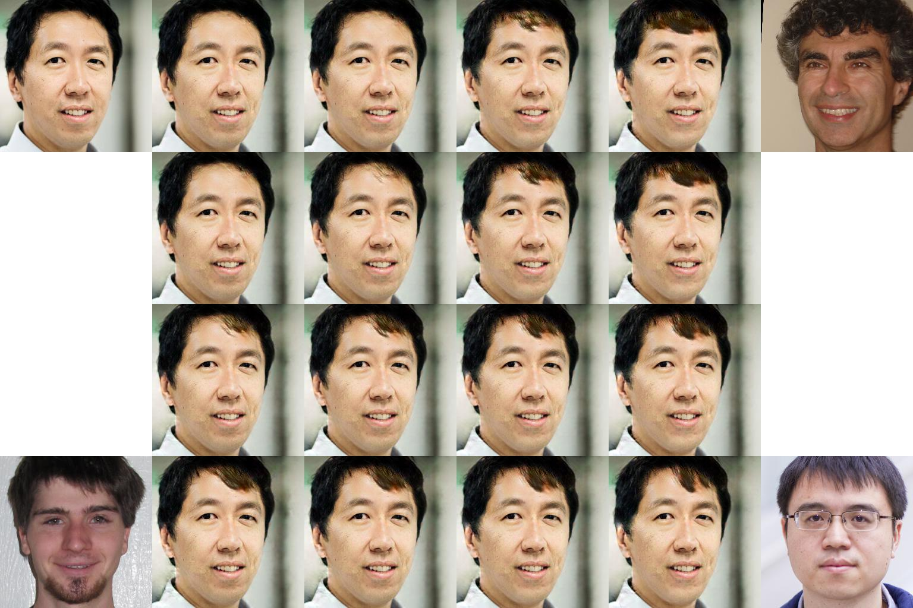
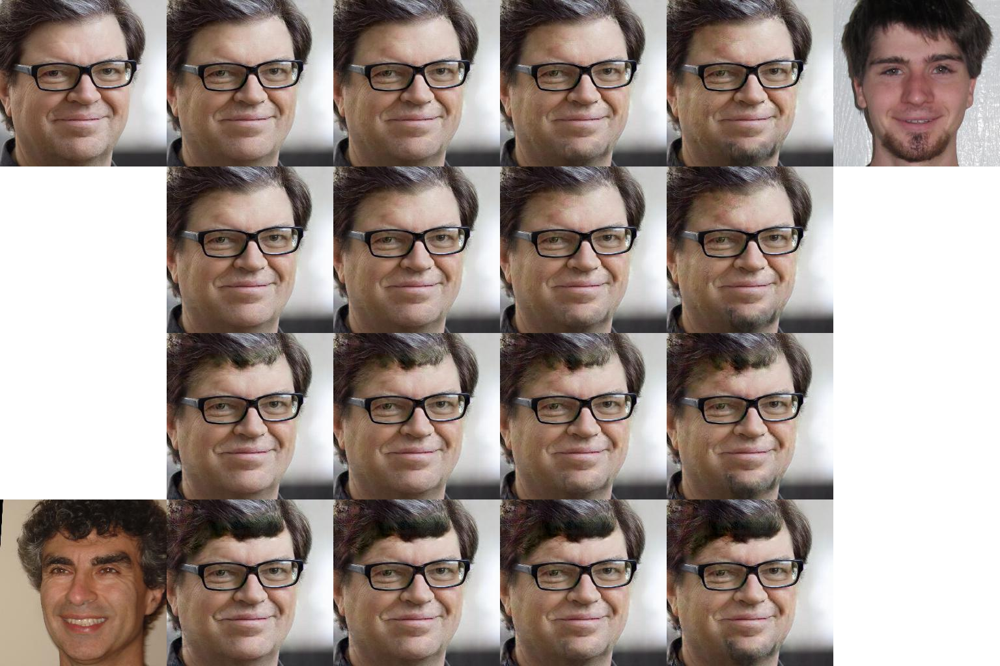

# ELEGANT: Exchanging Latent Encodings with GAN for Transferring Multiple Face Attributes

Taihong Xiao, Jiapeng Hong and Jinwen Ma

Please cite our paper if you find it useful to your research.
```
@InProceedings{Xiao_2018_ECCV,
    author = {Xiao, Taihong and Hong, Jiapeng and Ma, Jinwen},
    title = {ELEGANT: Exchanging Latent Encodings with GAN for Transferring Multiple Face Attributes},
    booktitle = {Proceedings of the European Conference on Computer Vision (ECCV)},
    pages = {172--187},
    month = {September},
    year = {2018}
}
```

## Introduction

This repo is the pytorch implementation of our [paper](https://arxiv.org/abs/1803.10562).
ELEGANT is a novel model for transferring multiple face attributes by exchanging latent encodings.
The model framework is shown below.

<div align="center">

</div>
<div align="center">
The ELEGANT Model Framework
</div>
<br/>

**If you want to train or test the model on your own images, please do the facial landmark alignment first. We preprocess the whole datasete using 5p alignment [here](https://github.com/Prinsphield/ELEGANT/blob/master/preprocess.py). However, you can use other alignment algorithm as long as it is consistent in both training and testing phases.**


## Requirements

- [Python 2.7 or 3.x](https://www.python.org/)
- [OpenCV 3](https://opencv.org/)
- [Pytorch 0.3](http://pytorch.org/)
- [TensorboardX](https://github.com/lanpa/tensorboard-pytorch)

## Training on CelebA dataset

0. Download [celebA](http://mmlab.ie.cuhk.edu.hk/projects/CelebA.html) dataset and unzip it into
`datasets` directory. There are various source providers for CelebA datasets. To ensure that the
size of downloaded images is correct, please run `identify datasets/celebA/data/000001.jpg`. The
size should be 409 x 687 if you are using the same dataset. Besides, please ensure that you have
the following directory tree structure in your repo.

```
├── datasets
│   └── celebA
│       ├── data
│       ├── images.list
│       ├── list_attr_celeba.txt
│       └── list_landmarks_celeba.txt
```

1. Run `python preprocess.py`. It will take only few minutes to preprocess all images.
A new directory `datasets/celebA/align_5p` will be created.

2. Run `python ELEGANT.py -m train -a Bangs Mustache -g 0` to train ELEGANT with respect to two attributes
`Bangs` and `Mustache` simultaneuously. You can play with other attributes as well. Please refer
to `list_attr_celeba.txt` for all available attributes. If training ELEGANT with more than one gpu cards,
you can accordingly increase the batch size, which is indicated in the first number of `nchw` in `dataset.py`.

3. Run `tensorboard --logdir=./train_log/log --port=6006` to watch your training process.
You can use tags matching for inspecting one group of images.
For example, if you type `0_04` in the image tags matching box, then a group of 10 images should be displayed
together, including two original images, four residual images and four generated images.
In the notation `0_04`, `0` indicates the first attribute and the `04` indicates the 4-th group.


## Testing

We provide four types of mode for testing. Let me explain all the parameters for testing.

- `-a`: All attributes' names.
- `-r`: Restore checkpoint.
- `-g`: The GPU id(s) for testing.
	- Don't add this parameter to your shell command if you don't want to use gpu for testing.
    - No more than 1 GPU should be specified during test, because 1 image cannot be split into multiple GPUs.
- `--swap`: Swap attribute of two images.
- `--linear`: Linear interpolation by adding or removing one certain attribute.
- `--matrix`: Matrix interpolation with respect to one or two attributes.
- `--swap_list`: The attribute id(s) for testing.
	- For example, `--swap_list 0` indicates the first attribute.
	- Receives **two** integers only in the interpolation with respect to two attributes.
	- In other cases, **only one** integer is required.
- `--input`: Input images path that you want to transfer.
- `--target`: Target image(s) path for reference.
	- **Only one** target image is needed in the `--swap` and `--linear` mode.
	- **Three** target images are needed in the `--matrix` mode with respect to one attribute.
	- **Two** target images are required in the `--matrix` mode with respect to two attributes.
- `-s`: The output size for interpolation.
	- **One** integer is needed in the `--linear` mode.
	- **Two** integers are required for the `--matrix` mode.

### 1. Swap Attribute

We can swap the `Mustache` attribute of two images. Here `--swap_list 1` indicates the second
attribute should be swapped and `-r 34000` means restoring trained model of step 34000.
You can choose the best model by inspecting the quality of generated images in tensorboard or
in the directory `train_log/img/`.

    python ELEGANT.py -m test -a Bangs Mustache -r 34000 --swap --swap_list 1 --input ./images/goodfellow_aligned.png --target ./images/bengio_aligned.png

<div align="center">

</div>
<div align="center">
Swap Mustache
</div>
<br/>


### 2. Linear Interpolation

We can see the linear interpolation results of adding mustache to Bengio by running the following.
`-s 4` indicates the number of intermediate images.

    python ELEGANT.py -m test -a Bangs Mustache -r 34000 --linear --swap_list 1 --input ./images/bengio_aligned.png --target ./images/goodfellow_aligned.png -s 4

<div align="center">

</div>
<div align="center">
Linear Interpolation on Mustache
</div>
<br/>


### 3. Matrix Interpolation with Respect to One Attribute

We can also add different kinds of bangs to a single person. Here, `--swap_list 0` indicates we are
dealing with the first attribute, and there are three target images provided for reference.

    python ELEGANT.py -m test -a Bangs Mustache -r 34000 --matrix --swap_list 0 --input ./images/ng_aligned.png --target ./images/bengio_aligned.png ./images/goodfellow_aligned.png ./images/jian_sun_aligned.png -s 4 4

<div align="center">

</div>
<div align="center">
Matrix Interpolation on different Bangs
</div>
<br/>


### 4. Matrix Interpolation with Respect to Two Attributes

We can transfer two attributes simultaneously by running the following command.

    python ELEGANT.py -m test -a Bangs Mustache -r 34000 --matrix --swap_list 0 1 --input ./images/lecun_aligned.png --target ./images/bengio_aligned.png ./images/goodfellow_aligned.png -s 4 4

The original image gradually owns the first attribute Bangs in the vertical direction and the second
attribute Mustache in the horizontal direction.

<div align="center">

</div>
<div align="center">
Matrix Interpolation on Bangs and Mustache
</div>
<br/>

## References

- [GeneGAN: Learning Object Transfiguration and Attribute Subspace from Unpaired Data](https://github.com/Prinsphield/GeneGAN)
- [DNA-GAN: Learning Disentangled Representations from Multi-Attribute Images](https://github.com/Prinsphield/DNA-GAN)


